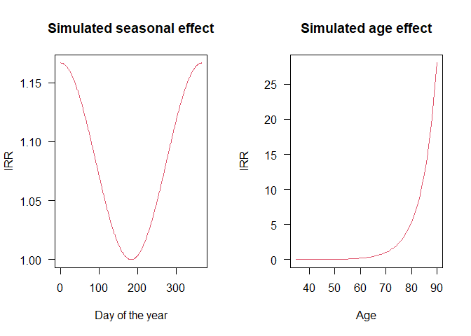
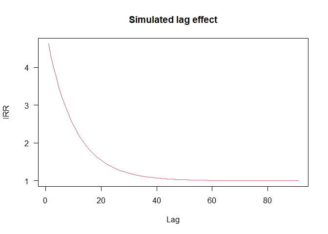
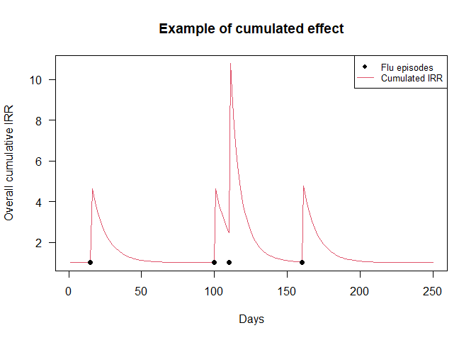
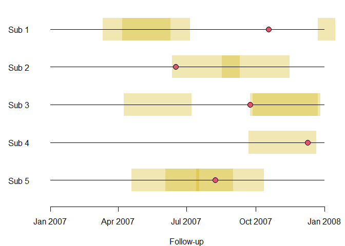
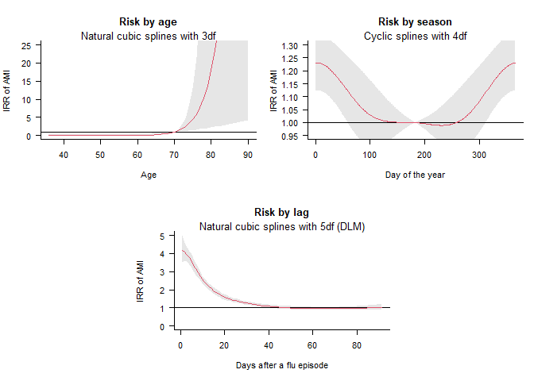
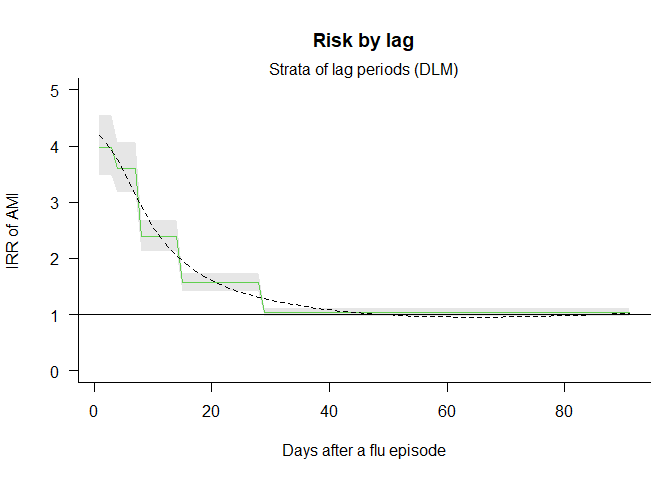

CTSclinepi.R
================

``` r
################################################################################
# Updated version of the R code for the first case-study in:
#
#   "The case time series design"
#   Epidemiology, 2021
#   Antonio Gasparrini
#   http://www.ag-myresearch.com/2021_gasparrini_epidem.html
#
# * an up-to-date version of this code is available at:
#   https://github.com/gasparrini/CaseTimeSeries
################################################################################

knitr::opts_chunk$set(echo=TRUE, fig.align='center', cache=TRUE, cache.lazy=FALSE)
knitr::opts_knit$set(global.par=TRUE)

################################################################################
# PREPARATION
################################################################################

library(dlnm) ; library(gnm) ; library(pbs)
library(data.table) ; library(scales)

set.seed(13041975)
par(las=1)

################################################################################
# SIMULATING THE ORIGINAL DATA
################################################################################

n <- 3927
dstart <- as.Date("2007-01-01")
dend <- as.Date("2007-12-31")

date <- seq(dstart, dend, by=1)
times <- seq(length(date))
month <- month(date)
doy <- yday(date)
dob <- sample(seq(dstart-round(100*365.25), dstart-round(35*365.25), by=1), n)

frrseas <- function(doy) (cos(doy*2*pi / 366) + 1) / 12 + 1
frrage <- function(age) exp((age - 70) / 6)

layout(t(1:2))
plot(1:365, frrseas(1:365), type="l", col=2, ylab="IRR", xlab="Day of the year",
  main="Simulated seasonal effect")
plot(35:90, frrage(35:90), type="l", col=2, ylab="IRR", xlab="Age",
  main="Simulated age effect")
```

<!-- -->

``` r
layout(1)

frrlag <- function(lag) exp(-(lag/10)) * 4 + 1
plot(1:91, frrlag(1:91), type="l", col=2, ylab="IRR", xlab="Lag",
  main="Simulated lag effect")
```

<!-- -->

``` r
expprof <- as.numeric(seq(250) %in% c(15,100,110,160))
exphist <- exphist(expprof, lag=c(1,91), fill=0)
rrflu <- apply(exphist, 1, function(x) prod(frrlag(1:91)[x==1]))
plot(seq(250), rrflu, type="l", col=2, ylab="Overall cumulative IRR", xlab="Days",
  main="Example of cumulated effect")
points(c(15,100,110,160), rep(1,4), pch=19)
legend("topright", c("Flu episodes","Cumulated IRR"), pch=c(19,NA), lty=c(NA,1),
  col=1:2, cex=0.8)
```

<!-- -->

``` r
dlist <- lapply(seq(n), function(i) {
  
  nflu <- rpois(1,1) + 1
  expprof <- drop(rmultinom(1, nflu, frrseas(doy))) > 0 + 0
  
  exphist <- exphist(expprof, lag=c(1,91), fill=0)
  rrflu <- apply(exphist, 1, function(x) prod(frrlag(1:91)[x==1]))
  
  rrtot <- frrage(as.numeric((date-dob[i])/365.25)) * frrseas(doy) * rrflu
  devent <-  date[drop(rmultinom(1, 1, rrtot))==1]
  
  data <- data.frame(id = paste0("sub", sprintf("%03d", i)), dob = dob[i],
    start = as.numeric(dstart - dob[i]), end = as.numeric(dend - dob[i]),
    event = as.numeric(devent - dob[i]))
  flu <- as.numeric(date[expprof == 1] - dob[i])
  for(j in seq(10)) data[paste0("flu", j)] <- if(j>nflu) NA else flu[j]
  
  return(data)
})
dataorig <- do.call(rbind, dlist)

rio::export(dataorig, 
            here::here("note_CTSclinepi_original/clinepi_original.csv"))

################################################################################
# DATA EXPANSION
################################################################################

(sub <- dataorig[3,])
```

    ##       id        dob start   end event  flu1  flu2  flu3 flu4 flu5 flu6 flu7 flu8 flu9 flu10
    ## 3 sub003 1916-08-18 33008 33372 33274 33105 33273 33276   NA   NA   NA   NA   NA   NA    NA

``` r
date <- as.Date(sub$start:sub$end, origin=sub$dob)
datasub <- data.frame(
  id = sub$id,
  date = date,
  times = seq(length(date)),
  age = as.numeric(date-sub$dob)/365.25,
  y = as.numeric(date-sub$dob) %in% sub$event + 0,
  flu = as.numeric(date-sub$dob) %in% na.omit(as.numeric(sub[6:15])) + 0,
  month = month(date),
  doy = yday(date)
)

head(datasub)
```

    ##       id       date times      age y flu month doy
    ## 1 sub003 2007-01-01     1 90.37098 0   0     1   1
    ## 2 sub003 2007-01-02     2 90.37372 0   0     1   2
    ## 3 sub003 2007-01-03     3 90.37645 0   0     1   3
    ## 4 sub003 2007-01-04     4 90.37919 0   0     1   4
    ## 5 sub003 2007-01-05     5 90.38193 0   0     1   5
    ## 6 sub003 2007-01-06     6 90.38467 0   0     1   6

``` r
tail(datasub)
```

    ##         id       date times      age y flu month doy
    ## 360 sub003 2007-12-26   360 91.35387 0   0    12 360
    ## 361 sub003 2007-12-27   361 91.35661 0   0    12 361
    ## 362 sub003 2007-12-28   362 91.35934 0   0    12 362
    ## 363 sub003 2007-12-29   363 91.36208 0   0    12 363
    ## 364 sub003 2007-12-30   364 91.36482 0   0    12 364
    ## 365 sub003 2007-12-31   365 91.36756 0   0    12 365

``` r
exphistsub <- exphist(datasub$flu, lag=c(1,91), fill=0)

timeflu1 <- sub$flu1-sub$start+1
exphistsub[timeflu1 + 0:5, 1:10]
```

    ##     lag1 lag2 lag3 lag4 lag5 lag6 lag7 lag8 lag9 lag10
    ## 98     0    0    0    0    0    0    0    0    0     0
    ## 99     1    0    0    0    0    0    0    0    0     0
    ## 100    0    1    0    0    0    0    0    0    0     0
    ## 101    0    0    1    0    0    0    0    0    0     0
    ## 102    0    0    0    1    0    0    0    0    0     0
    ## 103    0    0    0    0    1    0    0    0    0     0

``` r
dlist <- lapply(seq(n), function(i) {

  sub <- dataorig[i,]
  
  date <- as.Date(sub$start:sub$end, origin=sub$dob)
  data <- data.frame(
    id = sub$id,
    date = date,
    times = seq(length(date)),
    age = as.numeric(date-sub$dob)/365.25,
    y = as.numeric(date-sub$dob) %in% sub$event + 0,
    flu = as.numeric(date-sub$dob) %in% na.omit(as.numeric(sub[6:15])) + 0,
    month = month(date),
    doy = yday(date)
  )
  
  exphist <- exphist(data$flu, lag=c(1,91), fill=0)

  return(data.table(cbind(data, exphist)))
})
data <- do.call(rbind, dlist)

dlist |> tibble::enframe(name = "id")
```

    ## # A tibble: 3,927 × 2
    ##       id value          
    ##    <int> <list>         
    ##  1     1 <dt [365 × 99]>
    ##  2     2 <dt [365 × 99]>
    ##  3     3 <dt [365 × 99]>
    ##  4     4 <dt [365 × 99]>
    ##  5     5 <dt [365 × 99]>
    ##  6     6 <dt [365 × 99]>
    ##  7     7 <dt [365 × 99]>
    ##  8     8 <dt [365 × 99]>
    ##  9     9 <dt [365 × 99]>
    ## 10    10 <dt [365 × 99]>
    ## # ℹ 3,917 more rows

``` r
dlist[[1]] |> names()
```

    ##  [1] "id"    "date"  "times" "age"   "y"     "flu"   "month" "doy"   "lag1"  "lag2"  "lag3" 
    ## [12] "lag4"  "lag5"  "lag6"  "lag7"  "lag8"  "lag9"  "lag10" "lag11" "lag12" "lag13" "lag14"
    ## [23] "lag15" "lag16" "lag17" "lag18" "lag19" "lag20" "lag21" "lag22" "lag23" "lag24" "lag25"
    ## [34] "lag26" "lag27" "lag28" "lag29" "lag30" "lag31" "lag32" "lag33" "lag34" "lag35" "lag36"
    ## [45] "lag37" "lag38" "lag39" "lag40" "lag41" "lag42" "lag43" "lag44" "lag45" "lag46" "lag47"
    ## [56] "lag48" "lag49" "lag50" "lag51" "lag52" "lag53" "lag54" "lag55" "lag56" "lag57" "lag58"
    ## [67] "lag59" "lag60" "lag61" "lag62" "lag63" "lag64" "lag65" "lag66" "lag67" "lag68" "lag69"
    ## [78] "lag70" "lag71" "lag72" "lag73" "lag74" "lag75" "lag76" "lag77" "lag78" "lag79" "lag80"
    ## [89] "lag81" "lag82" "lag83" "lag84" "lag85" "lag86" "lag87" "lag88" "lag89" "lag90" "lag91"

``` r
dlist[[1]] |> tibble::tibble()
```

    ## # A tibble: 365 × 99
    ##    id    date       times   age     y   flu month   doy  lag1  lag2  lag3  lag4  lag5  lag6  lag7
    ##    <chr> <date>     <int> <dbl> <dbl> <dbl> <int> <int> <dbl> <dbl> <dbl> <dbl> <dbl> <dbl> <dbl>
    ##  1 sub0… 2007-01-01     1  92.7     0     0     1     1     0     0     0     0     0     0     0
    ##  2 sub0… 2007-01-02     2  92.7     0     0     1     2     0     0     0     0     0     0     0
    ##  3 sub0… 2007-01-03     3  92.7     0     0     1     3     0     0     0     0     0     0     0
    ##  4 sub0… 2007-01-04     4  92.7     0     0     1     4     0     0     0     0     0     0     0
    ##  5 sub0… 2007-01-05     5  92.7     0     0     1     5     0     0     0     0     0     0     0
    ##  6 sub0… 2007-01-06     6  92.7     0     0     1     6     0     0     0     0     0     0     0
    ##  7 sub0… 2007-01-07     7  92.7     0     0     1     7     0     0     0     0     0     0     0
    ##  8 sub0… 2007-01-08     8  92.7     0     0     1     8     0     0     0     0     0     0     0
    ##  9 sub0… 2007-01-09     9  92.7     0     0     1     9     0     0     0     0     0     0     0
    ## 10 sub0… 2007-01-10    10  92.7     0     0     1    10     0     0     0     0     0     0     0
    ## # ℹ 355 more rows
    ## # ℹ 84 more variables: lag8 <dbl>, lag9 <dbl>, lag10 <dbl>, lag11 <dbl>, lag12 <dbl>,
    ## #   lag13 <dbl>, lag14 <dbl>, lag15 <dbl>, lag16 <dbl>, lag17 <dbl>, lag18 <dbl>, lag19 <dbl>,
    ## #   lag20 <dbl>, lag21 <dbl>, lag22 <dbl>, lag23 <dbl>, lag24 <dbl>, lag25 <dbl>, lag26 <dbl>,
    ## #   lag27 <dbl>, lag28 <dbl>, lag29 <dbl>, lag30 <dbl>, lag31 <dbl>, lag32 <dbl>, lag33 <dbl>,
    ## #   lag34 <dbl>, lag35 <dbl>, lag36 <dbl>, lag37 <dbl>, lag38 <dbl>, lag39 <dbl>, lag40 <dbl>,
    ## #   lag41 <dbl>, lag42 <dbl>, lag43 <dbl>, lag44 <dbl>, lag45 <dbl>, lag46 <dbl>, lag47 <dbl>, …

``` r
rio::export(dlist,
            here::here("note_CTSclinepi_original/clinepi_expanded.rds"))

################################################################################
# ANALYSIS
################################################################################

par(mar=c(4,4,0.3,1))
plot(unique(data$date), unique(data$date), ylim=c(0.5,5+0.5), yaxt="n",
  ylab="", xlab="Follow-up", frame.plot=F)
axis(2, at=5:1, labels=paste("Sub",1:5), lwd=0, las=1)
for(i in 5:1) {
  sub <- subset(data, id==unique(data$id)[6-i])
  flu <- sub$date[sub$flu==1]
  rect(flu+1, rep(i-0.3,length(flu)), flu+91, rep(i+0.3,length(flu)), border=NA,
    col=alpha("gold3",0.3))
  lines(sub$date, rep(i, nrow(sub)))
  points(sub$date[sub$y==1], i, pch=21, bg=2, cex=1.5)
}
```

<!-- -->

``` r
par(mar=c(5,4,4,1)+0.1)

splage <- onebasis(data$age, "ns", knots=quantile(data$age, c(1,3)*0.25))
summary(splage)
```

    ## BASIS FUNCTION
    ## observations: 1433355 
    ## range: 35.01164 100.9938 
    ## df: 3 
    ## fun: ns 
    ## knots: 52.3258 84.56674 
    ## intercept: FALSE 
    ## Boundary.knots: 35.01164 100.9938

``` r
splseas <- onebasis(data$doy, "pbs", df=3)
summary(splseas)
```

    ## BASIS FUNCTION
    ## observations: 1433355 
    ## range: 1 365 
    ## df: 3 
    ## fun: pbs 
    ## knots: 92 183 274 
    ## degree: 3 
    ## intercept: FALSE 
    ## Boundary.knots: 1 365 
    ## periodic: TRUE

``` r
exphist <- data[,-c(1:8)]
cbspl <- crossbasis(exphist, lag=c(1,91), argvar=list("strata",breaks=0.5),
  arglag=list("ns",knots=c(3,10,29)))

summary(cbspl)
```

    ## CROSSBASIS FUNCTIONS
    ## observations: 1433355 
    ## range: 0 to 1 
    ## lag period: 1 91 
    ## total df:  5 
    ## 
    ## BASIS FOR VAR:
    ## fun: strata 
    ## df: 1 
    ## breaks: 0.5 
    ## ref: 1 
    ## intercept: FALSE 
    ## 
    ## BASIS FOR LAG:
    ## fun: ns 
    ## knots: 3 10 29 
    ## intercept: TRUE 
    ## Boundary.knots: 1 91

``` r
mspl <- gnm(y ~ cbspl+splage+splseas, data=data, family=poisson,
  eliminate=factor(id))

summary(mspl)
```

    ## 
    ## Call:
    ## gnm(formula = y ~ cbspl + splage + splseas, eliminate = factor(id), 
    ##     family = poisson, data = data)
    ## 
    ## Deviance Residuals: 
    ##      Min        1Q    Median        3Q       Max  
    ## -0.34782  -0.07277  -0.06797  -0.06485   3.34297  
    ## 
    ## Coefficients of interest:
    ##            Estimate Std. Error z value Pr(>|z|)    
    ## cbsplv1.l1  1.20474    0.08666  13.902  < 2e-16 ***
    ## cbsplv1.l2  0.60191    0.07830   7.688  < 2e-16 ***
    ## cbsplv1.l3 -0.90848    0.10329  -8.795  < 2e-16 ***
    ## cbsplv1.l4  1.64007    0.10122  16.204  < 2e-16 ***
    ## cbsplv1.l5 -0.93706    0.09175 -10.213  < 2e-16 ***
    ## splageb1   10.67838    4.15808   2.568   0.0102 *  
    ## splageb2   17.07716    7.13878   2.392   0.0167 *  
    ## splageb3   13.22422    4.74323   2.788   0.0053 ** 
    ## splseasb1  -0.07791    0.15253  -0.511   0.6095    
    ## splseasb2   0.31052    0.06958   4.463  8.1e-06 ***
    ## splseasb3  -0.04795    0.15796  -0.304   0.7615    
    ## ---
    ## Signif. codes:  0 '***' 0.001 '**' 0.01 '*' 0.05 '.' 0.1 ' ' 1
    ## 
    ## (Dispersion parameter for poisson family taken to be 1)
    ## 
    ## Residual deviance: 45508 on 1429417 degrees of freedom
    ## AIC: 61238
    ## 
    ## Number of iterations: 5

``` r
cpspl <- crosspred(cbspl, mspl, at=1)
cpsplage <- crosspred(splage, mspl, cen=70, to=90)
cpsplseas <- crosspred(splseas, mspl, cen=366/2, at=1:365)

layout(matrix(c(1,1,2,2,0,3,3,0),2,byrow=T))
plot(cpsplage, col=2, ylab="IRR of AMI", xlab="Age", main="Risk by age",
  ylim=c(0,25))
mtext("Natural cubic splines with 3df", cex=0.8)
plot(cpsplseas, col=2, ylab="IRR of AMI", xlab="Day of the year",
  main="Risk by season", ylim=c(0.95,1.30))
mtext("Cyclic splines with 4df", cex=0.8)
plot(cpspl, var=1, col=2, ylab="IRR of AMI", xlab="Days after a flu episode",
  ylim=c(0,5), main="Risk by lag")
mtext("Natural cubic splines with 5df (DLM)", cex=0.8)
```

<!-- -->

``` r
layout(1)

cbstr <- crossbasis(exphist, lag=c(1,91), argvar=list("strata",breaks=0.5),
  arglag=list("strata",breaks=c(4,8,15,29)))
summary(cbstr)
```

    ## CROSSBASIS FUNCTIONS
    ## observations: 1433355 
    ## range: 0 to 1 
    ## lag period: 1 91 
    ## total df:  5 
    ## 
    ## BASIS FOR VAR:
    ## fun: strata 
    ## df: 1 
    ## breaks: 0.5 
    ## ref: 1 
    ## intercept: FALSE 
    ## 
    ## BASIS FOR LAG:
    ## fun: strata 
    ## df: 5 
    ## breaks: 4 8 15 29 
    ## ref: 1 
    ## intercept: TRUE

``` r
mstr <- gnm(y ~ cbstr+splage+splseas, data=data, family=poisson,
  eliminate=factor(id))
summary(mstr)
```

    ## 
    ## Call:
    ## gnm(formula = y ~ cbstr + splage + splseas, eliminate = factor(id), 
    ##     family = poisson, data = data)
    ## 
    ## Deviance Residuals: 
    ##      Min        1Q    Median        3Q       Max  
    ## -0.32326  -0.07267  -0.06801  -0.06509   3.34195  
    ## 
    ## Coefficients of interest:
    ##            Estimate Std. Error z value Pr(>|z|)    
    ## cbstrv1.l1  1.37826    0.06835  20.164  < 2e-16 ***
    ## cbstrv1.l2 -0.09830    0.09024  -1.089   0.2760    
    ## cbstrv1.l3 -0.50737    0.08788  -5.774 7.76e-09 ***
    ## cbstrv1.l4 -0.92812    0.08371 -11.087  < 2e-16 ***
    ## cbstrv1.l5 -1.34559    0.07401 -18.180  < 2e-16 ***
    ## splageb1   10.24715    4.15389   2.467   0.0136 *  
    ## splageb2   16.24471    7.13123   2.278   0.0227 *  
    ## splageb3   12.66770    4.73788   2.674   0.0075 ** 
    ## splseasb1  -0.07370    0.15237  -0.484   0.6286    
    ## splseasb2   0.31759    0.06953   4.568 4.93e-06 ***
    ## splseasb3  -0.04901    0.15771  -0.311   0.7560    
    ## ---
    ## Signif. codes:  0 '***' 0.001 '**' 0.01 '*' 0.05 '.' 0.1 ' ' 1
    ## 
    ## (Dispersion parameter for poisson family taken to be 1)
    ## 
    ## Residual deviance: 45531 on 1429417 degrees of freedom
    ## AIC: 61261
    ## 
    ## Number of iterations: 5

``` r
cpstr <- crosspred(cbstr, mstr, at=1)

plot(cpstr, var=1, col=3, ylab="IRR of AMI", xlab="Days after a flu episode",
  ylim=c(0,5), main="Risk by lag")
mtext("Strata of lag periods (DLM)", cex=1)
lines(cpspl, var=1, lty=2)
```

<!-- -->

``` r
resstr <- round(with(cpstr, t(rbind(matRRfit,matRRlow,matRRhigh))), 2)
colnames(resstr) <- c("IRR","low95%CI","high95%CI")
resstr[paste0("lag", c(1,4,8,15,29)),]
```

    ##        IRR low95%CI high95%CI
    ## lag1  3.97     3.47      4.54
    ## lag4  3.60     3.18      4.07
    ## lag8  2.39     2.13      2.68
    ## lag15 1.57     1.42      1.74
    ## lag29 1.03     0.97      1.11
