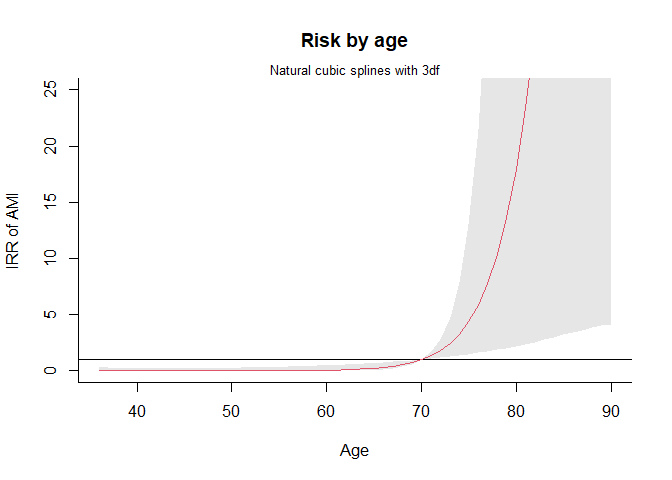
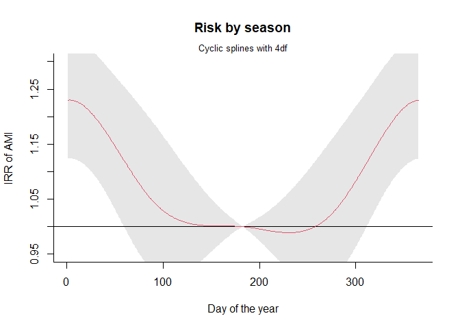
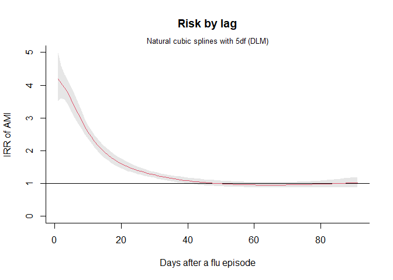

Note for CTSclinepi example
================

``` r
pacman::p_load(
  rio,            # import and export files
  here,           # locate files 
  tidyverse,      # data management and visualization
  gnm,
  dlnm,
  splines,
  pbs
)
```

# Data

``` r
# data #-----------
```

Originial data

``` r
(data_orginial <- rio::import(here("note_CTSclinepi/clinepi_original.csv")) %>% 
  tibble())
```

    ## # A tibble: 3,927 × 15
    ##    id     dob        start   end event  flu1  flu2  flu3  flu4  flu5  flu6  flu7  flu8  flu9 flu10
    ##    <chr>  <IDate>    <int> <int> <int> <int> <int> <int> <int> <int> <int> <int> <int> <int> <lgl>
    ##  1 sub001 1914-04-25 33854 34218 34144 33923 33949 34209    NA    NA    NA    NA    NA    NA NA   
    ##  2 sub002 1933-07-27 26821 27185 26988 26982 27048    NA    NA    NA    NA    NA    NA    NA NA   
    ##  3 sub003 1916-08-18 33008 33372 33274 33105 33273 33276    NA    NA    NA    NA    NA    NA NA   
    ##  4 sub004 1945-05-01 22525 22889 22867 22788    NA    NA    NA    NA    NA    NA    NA    NA NA   
    ##  5 sub005 1936-05-24 25789 26153 26008 25896 25941 25982    NA    NA    NA    NA    NA    NA NA   
    ##  6 sub006 1916-03-24 33155 33519 33460 33281    NA    NA    NA    NA    NA    NA    NA    NA NA   
    ##  7 sub007 1969-10-07 13600 13964 13711 13942    NA    NA    NA    NA    NA    NA    NA    NA NA   
    ##  8 sub008 1955-01-16 18978 19342 19338 19022 19273    NA    NA    NA    NA    NA    NA    NA NA   
    ##  9 sub009 1956-09-02 18383 18747 18738 18637    NA    NA    NA    NA    NA    NA    NA    NA NA   
    ## 10 sub010 1937-12-10 25224 25588 25281 25335 25551    NA    NA    NA    NA    NA    NA    NA NA   
    ## # ℹ 3,917 more rows

``` r
data_orginial %>% tail(n = 10)
```

    ## # A tibble: 10 × 15
    ##    id      dob        start   end event  flu1  flu2  flu3  flu4  flu5  flu6  flu7  flu8  flu9 flu10
    ##    <chr>   <IDate>    <int> <int> <int> <int> <int> <int> <int> <int> <int> <int> <int> <int> <lgl>
    ##  1 sub3918 1925-04-11 29850 30214 29853 29896 29922 30159    NA    NA    NA    NA    NA    NA NA   
    ##  2 sub3919 1936-10-27 25633 25997 25751 25766    NA    NA    NA    NA    NA    NA    NA    NA NA   
    ##  3 sub3920 1951-04-16 20349 20713 20709 20450 20712    NA    NA    NA    NA    NA    NA    NA NA   
    ##  4 sub3921 1957-09-30 17990 18354 18277 18163 18173    NA    NA    NA    NA    NA    NA    NA NA   
    ##  5 sub3922 1969-05-10 13750 14114 13791 13803 14022    NA    NA    NA    NA    NA    NA    NA NA   
    ##  6 sub3923 1923-06-01 30530 30894 30627 30622    NA    NA    NA    NA    NA    NA    NA    NA NA   
    ##  7 sub3924 1944-12-11 22666 23030 22899 22673    NA    NA    NA    NA    NA    NA    NA    NA NA   
    ##  8 sub3925 1964-02-29 15647 16011 15675 15933    NA    NA    NA    NA    NA    NA    NA    NA NA   
    ##  9 sub3926 1960-04-21 17056 17420 17069 17215 17223 17405    NA    NA    NA    NA    NA    NA NA   
    ## 10 sub3927 1966-10-17 14686 15050 14808 14903    NA    NA    NA    NA    NA    NA    NA    NA NA

Expanded data

``` r
data_expanded <- rio::import(here("note_CTSclinepi/clinepi_expanded.rds"))

data_expanded %>% enframe()
```

    ## # A tibble: 3,927 × 2
    ##     name value          
    ##    <int> <list>         
    ##  1     1 <dt [365 × 99]>
    ##  2     2 <dt [365 × 99]>
    ##  3     3 <dt [365 × 99]>
    ##  4     4 <dt [365 × 99]>
    ##  5     5 <dt [365 × 99]>
    ##  6     6 <dt [365 × 99]>
    ##  7     7 <dt [365 × 99]>
    ##  8     8 <dt [365 × 99]>
    ##  9     9 <dt [365 × 99]>
    ## 10    10 <dt [365 × 99]>
    ## # ℹ 3,917 more rows

Example of patient sub001 - first 10 rows

``` r
data_expanded[[1]] %>% tibble()
```

    ## # A tibble: 365 × 99
    ##    id     date       times   age     y   flu month   doy  lag1  lag2  lag3  lag4  lag5  lag6  lag7
    ##    <chr>  <date>     <int> <dbl> <dbl> <dbl> <int> <int> <dbl> <dbl> <dbl> <dbl> <dbl> <dbl> <dbl>
    ##  1 sub001 2007-01-01     1  92.7     0     0     1     1     0     0     0     0     0     0     0
    ##  2 sub001 2007-01-02     2  92.7     0     0     1     2     0     0     0     0     0     0     0
    ##  3 sub001 2007-01-03     3  92.7     0     0     1     3     0     0     0     0     0     0     0
    ##  4 sub001 2007-01-04     4  92.7     0     0     1     4     0     0     0     0     0     0     0
    ##  5 sub001 2007-01-05     5  92.7     0     0     1     5     0     0     0     0     0     0     0
    ##  6 sub001 2007-01-06     6  92.7     0     0     1     6     0     0     0     0     0     0     0
    ##  7 sub001 2007-01-07     7  92.7     0     0     1     7     0     0     0     0     0     0     0
    ##  8 sub001 2007-01-08     8  92.7     0     0     1     8     0     0     0     0     0     0     0
    ##  9 sub001 2007-01-09     9  92.7     0     0     1     9     0     0     0     0     0     0     0
    ## 10 sub001 2007-01-10    10  92.7     0     0     1    10     0     0     0     0     0     0     0
    ## # ℹ 355 more rows
    ## # ℹ 84 more variables: lag8 <dbl>, lag9 <dbl>, lag10 <dbl>, lag11 <dbl>, lag12 <dbl>, lag13 <dbl>,
    ## #   lag14 <dbl>, lag15 <dbl>, lag16 <dbl>, lag17 <dbl>, lag18 <dbl>, lag19 <dbl>, lag20 <dbl>,
    ## #   lag21 <dbl>, lag22 <dbl>, lag23 <dbl>, lag24 <dbl>, lag25 <dbl>, lag26 <dbl>, lag27 <dbl>,
    ## #   lag28 <dbl>, lag29 <dbl>, lag30 <dbl>, lag31 <dbl>, lag32 <dbl>, lag33 <dbl>, lag34 <dbl>,
    ## #   lag35 <dbl>, lag36 <dbl>, lag37 <dbl>, lag38 <dbl>, lag39 <dbl>, lag40 <dbl>, lag41 <dbl>,
    ## #   lag42 <dbl>, lag43 <dbl>, lag44 <dbl>, lag45 <dbl>, lag46 <dbl>, lag47 <dbl>, lag48 <dbl>, …

Example of patient sub001 - last 10 rows

``` r
data_expanded[[1]] %>% tibble() %>% tail(n = 10)
```

    ## # A tibble: 10 × 99
    ##    id     date       times   age     y   flu month   doy  lag1  lag2  lag3  lag4  lag5  lag6  lag7
    ##    <chr>  <date>     <int> <dbl> <dbl> <dbl> <int> <int> <dbl> <dbl> <dbl> <dbl> <dbl> <dbl> <dbl>
    ##  1 sub001 2007-12-22   356  93.7     0     1    12   356     0     0     0     0     0     0     0
    ##  2 sub001 2007-12-23   357  93.7     0     0    12   357     1     0     0     0     0     0     0
    ##  3 sub001 2007-12-24   358  93.7     0     0    12   358     0     1     0     0     0     0     0
    ##  4 sub001 2007-12-25   359  93.7     0     0    12   359     0     0     1     0     0     0     0
    ##  5 sub001 2007-12-26   360  93.7     0     0    12   360     0     0     0     1     0     0     0
    ##  6 sub001 2007-12-27   361  93.7     0     0    12   361     0     0     0     0     1     0     0
    ##  7 sub001 2007-12-28   362  93.7     0     0    12   362     0     0     0     0     0     1     0
    ##  8 sub001 2007-12-29   363  93.7     0     0    12   363     0     0     0     0     0     0     1
    ##  9 sub001 2007-12-30   364  93.7     0     0    12   364     0     0     0     0     0     0     0
    ## 10 sub001 2007-12-31   365  93.7     0     0    12   365     0     0     0     0     0     0     0
    ## # ℹ 84 more variables: lag8 <dbl>, lag9 <dbl>, lag10 <dbl>, lag11 <dbl>, lag12 <dbl>, lag13 <dbl>,
    ## #   lag14 <dbl>, lag15 <dbl>, lag16 <dbl>, lag17 <dbl>, lag18 <dbl>, lag19 <dbl>, lag20 <dbl>,
    ## #   lag21 <dbl>, lag22 <dbl>, lag23 <dbl>, lag24 <dbl>, lag25 <dbl>, lag26 <dbl>, lag27 <dbl>,
    ## #   lag28 <dbl>, lag29 <dbl>, lag30 <dbl>, lag31 <dbl>, lag32 <dbl>, lag33 <dbl>, lag34 <dbl>,
    ## #   lag35 <dbl>, lag36 <dbl>, lag37 <dbl>, lag38 <dbl>, lag39 <dbl>, lag40 <dbl>, lag41 <dbl>,
    ## #   lag42 <dbl>, lag43 <dbl>, lag44 <dbl>, lag45 <dbl>, lag46 <dbl>, lag47 <dbl>, lag48 <dbl>,
    ## #   lag49 <dbl>, lag50 <dbl>, lag51 <dbl>, lag52 <dbl>, lag53 <dbl>, lag54 <dbl>, lag55 <dbl>, …

Data for modelling

``` r
data <- data_expanded %>% list_rbind() %>% tibble()

data
```

    ## # A tibble: 1,433,355 × 99
    ##    id     date       times   age     y   flu month   doy  lag1  lag2  lag3  lag4  lag5  lag6  lag7
    ##    <chr>  <date>     <int> <dbl> <dbl> <dbl> <int> <int> <dbl> <dbl> <dbl> <dbl> <dbl> <dbl> <dbl>
    ##  1 sub001 2007-01-01     1  92.7     0     0     1     1     0     0     0     0     0     0     0
    ##  2 sub001 2007-01-02     2  92.7     0     0     1     2     0     0     0     0     0     0     0
    ##  3 sub001 2007-01-03     3  92.7     0     0     1     3     0     0     0     0     0     0     0
    ##  4 sub001 2007-01-04     4  92.7     0     0     1     4     0     0     0     0     0     0     0
    ##  5 sub001 2007-01-05     5  92.7     0     0     1     5     0     0     0     0     0     0     0
    ##  6 sub001 2007-01-06     6  92.7     0     0     1     6     0     0     0     0     0     0     0
    ##  7 sub001 2007-01-07     7  92.7     0     0     1     7     0     0     0     0     0     0     0
    ##  8 sub001 2007-01-08     8  92.7     0     0     1     8     0     0     0     0     0     0     0
    ##  9 sub001 2007-01-09     9  92.7     0     0     1     9     0     0     0     0     0     0     0
    ## 10 sub001 2007-01-10    10  92.7     0     0     1    10     0     0     0     0     0     0     0
    ## # ℹ 1,433,345 more rows
    ## # ℹ 84 more variables: lag8 <dbl>, lag9 <dbl>, lag10 <dbl>, lag11 <dbl>, lag12 <dbl>, lag13 <dbl>,
    ## #   lag14 <dbl>, lag15 <dbl>, lag16 <dbl>, lag17 <dbl>, lag18 <dbl>, lag19 <dbl>, lag20 <dbl>,
    ## #   lag21 <dbl>, lag22 <dbl>, lag23 <dbl>, lag24 <dbl>, lag25 <dbl>, lag26 <dbl>, lag27 <dbl>,
    ## #   lag28 <dbl>, lag29 <dbl>, lag30 <dbl>, lag31 <dbl>, lag32 <dbl>, lag33 <dbl>, lag34 <dbl>,
    ## #   lag35 <dbl>, lag36 <dbl>, lag37 <dbl>, lag38 <dbl>, lag39 <dbl>, lag40 <dbl>, lag41 <dbl>,
    ## #   lag42 <dbl>, lag43 <dbl>, lag44 <dbl>, lag45 <dbl>, lag46 <dbl>, lag47 <dbl>, lag48 <dbl>, …

``` r
data %>% tail(n = 10)
```

    ## # A tibble: 10 × 99
    ##    id      date       times   age     y   flu month   doy  lag1  lag2  lag3  lag4  lag5  lag6  lag7
    ##    <chr>   <date>     <int> <dbl> <dbl> <dbl> <int> <int> <dbl> <dbl> <dbl> <dbl> <dbl> <dbl> <dbl>
    ##  1 sub3927 2007-12-22   356  41.2     0     0    12   356     0     0     0     0     0     0     0
    ##  2 sub3927 2007-12-23   357  41.2     0     0    12   357     0     0     0     0     0     0     0
    ##  3 sub3927 2007-12-24   358  41.2     0     0    12   358     0     0     0     0     0     0     0
    ##  4 sub3927 2007-12-25   359  41.2     0     0    12   359     0     0     0     0     0     0     0
    ##  5 sub3927 2007-12-26   360  41.2     0     0    12   360     0     0     0     0     0     0     0
    ##  6 sub3927 2007-12-27   361  41.2     0     0    12   361     0     0     0     0     0     0     0
    ##  7 sub3927 2007-12-28   362  41.2     0     0    12   362     0     0     0     0     0     0     0
    ##  8 sub3927 2007-12-29   363  41.2     0     0    12   363     0     0     0     0     0     0     0
    ##  9 sub3927 2007-12-30   364  41.2     0     0    12   364     0     0     0     0     0     0     0
    ## 10 sub3927 2007-12-31   365  41.2     0     0    12   365     0     0     0     0     0     0     0
    ## # ℹ 84 more variables: lag8 <dbl>, lag9 <dbl>, lag10 <dbl>, lag11 <dbl>, lag12 <dbl>, lag13 <dbl>,
    ## #   lag14 <dbl>, lag15 <dbl>, lag16 <dbl>, lag17 <dbl>, lag18 <dbl>, lag19 <dbl>, lag20 <dbl>,
    ## #   lag21 <dbl>, lag22 <dbl>, lag23 <dbl>, lag24 <dbl>, lag25 <dbl>, lag26 <dbl>, lag27 <dbl>,
    ## #   lag28 <dbl>, lag29 <dbl>, lag30 <dbl>, lag31 <dbl>, lag32 <dbl>, lag33 <dbl>, lag34 <dbl>,
    ## #   lag35 <dbl>, lag36 <dbl>, lag37 <dbl>, lag38 <dbl>, lag39 <dbl>, lag40 <dbl>, lag41 <dbl>,
    ## #   lag42 <dbl>, lag43 <dbl>, lag44 <dbl>, lag45 <dbl>, lag46 <dbl>, lag47 <dbl>, lag48 <dbl>,
    ## #   lag49 <dbl>, lag50 <dbl>, lag51 <dbl>, lag52 <dbl>, lag53 <dbl>, lag54 <dbl>, lag55 <dbl>, …

``` r
3927*365
```

    ## [1] 1433355

# Analysis

``` r
# analysis #------------------------------
```

Natural cubic splines for `age`

``` r
splage <- onebasis(data$age, "ns", knots = quantile(data$age, c(1,3)*0.25))
summary(splage)
```

    ## BASIS FUNCTION
    ## observations: 1433355 
    ## range: 35.01164 100.9938 
    ## df: 3 
    ## fun: ns 
    ## knots: 52.3258 84.56674 
    ## intercept: FALSE 
    ## Boundary.knots: 35.01164 100.9938

Cyclic splines for `season`

``` r
splseas <- onebasis(data$doy, "pbs", df = 3)
summary(splseas)
```

    ## BASIS FUNCTION
    ## observations: 1433355 
    ## range: 1 365 
    ## df: 3 
    ## fun: pbs 
    ## knots: 92 183 274 
    ## degree: 3 
    ## intercept: FALSE 
    ## Boundary.knots: 1 365 
    ## periodic: TRUE

Distributed lag model (DLM): Cross-basis for `flu` with lag period from
1-91 days

``` r
# exposure history
(exphist <- data %>% select(contains("lag")))
```

    ## # A tibble: 1,433,355 × 91
    ##     lag1  lag2  lag3  lag4  lag5  lag6  lag7  lag8  lag9 lag10 lag11 lag12 lag13 lag14 lag15 lag16
    ##    <dbl> <dbl> <dbl> <dbl> <dbl> <dbl> <dbl> <dbl> <dbl> <dbl> <dbl> <dbl> <dbl> <dbl> <dbl> <dbl>
    ##  1     0     0     0     0     0     0     0     0     0     0     0     0     0     0     0     0
    ##  2     0     0     0     0     0     0     0     0     0     0     0     0     0     0     0     0
    ##  3     0     0     0     0     0     0     0     0     0     0     0     0     0     0     0     0
    ##  4     0     0     0     0     0     0     0     0     0     0     0     0     0     0     0     0
    ##  5     0     0     0     0     0     0     0     0     0     0     0     0     0     0     0     0
    ##  6     0     0     0     0     0     0     0     0     0     0     0     0     0     0     0     0
    ##  7     0     0     0     0     0     0     0     0     0     0     0     0     0     0     0     0
    ##  8     0     0     0     0     0     0     0     0     0     0     0     0     0     0     0     0
    ##  9     0     0     0     0     0     0     0     0     0     0     0     0     0     0     0     0
    ## 10     0     0     0     0     0     0     0     0     0     0     0     0     0     0     0     0
    ## # ℹ 1,433,345 more rows
    ## # ℹ 75 more variables: lag17 <dbl>, lag18 <dbl>, lag19 <dbl>, lag20 <dbl>, lag21 <dbl>,
    ## #   lag22 <dbl>, lag23 <dbl>, lag24 <dbl>, lag25 <dbl>, lag26 <dbl>, lag27 <dbl>, lag28 <dbl>,
    ## #   lag29 <dbl>, lag30 <dbl>, lag31 <dbl>, lag32 <dbl>, lag33 <dbl>, lag34 <dbl>, lag35 <dbl>,
    ## #   lag36 <dbl>, lag37 <dbl>, lag38 <dbl>, lag39 <dbl>, lag40 <dbl>, lag41 <dbl>, lag42 <dbl>,
    ## #   lag43 <dbl>, lag44 <dbl>, lag45 <dbl>, lag46 <dbl>, lag47 <dbl>, lag48 <dbl>, lag49 <dbl>,
    ## #   lag50 <dbl>, lag51 <dbl>, lag52 <dbl>, lag53 <dbl>, lag54 <dbl>, lag55 <dbl>, lag56 <dbl>, …

``` r
# cross-basis
cbspl <- crossbasis(exphist, 
                    lag = c(1, 91), 
                    argvar = list("strata", breaks = 0.5),
                    arglag = list("ns", knots = c(3, 10, 29)))
summary(cbspl)
```

    ## CROSSBASIS FUNCTIONS
    ## observations: 1433355 
    ## range: 0 to 1 
    ## lag period: 1 91 
    ## total df:  5 
    ## 
    ## BASIS FOR VAR:
    ## fun: strata 
    ## df: 1 
    ## breaks: 0.5 
    ## ref: 1 
    ## intercept: FALSE 
    ## 
    ## BASIS FOR LAG:
    ## fun: ns 
    ## knots: 3 10 29 
    ## intercept: TRUE 
    ## Boundary.knots: 1 91

Fitting fixed-effects Poisson regression

``` r
mspl <- gnm(y ~ cbspl + splage + splseas,
            data = data,
            family = poisson,
            eliminate = factor(id))

summary(mspl)
```

    ## 
    ## Call:
    ## gnm(formula = y ~ cbspl + splage + splseas, eliminate = factor(id), 
    ##     family = poisson, data = data)
    ## 
    ## Deviance Residuals: 
    ##      Min        1Q    Median        3Q       Max  
    ## -0.34782  -0.07277  -0.06797  -0.06485   3.34297  
    ## 
    ## Coefficients of interest:
    ##            Estimate Std. Error z value Pr(>|z|)    
    ## cbsplv1.l1  1.20474    0.08666  13.902  < 2e-16 ***
    ## cbsplv1.l2  0.60191    0.07830   7.688  < 2e-16 ***
    ## cbsplv1.l3 -0.90848    0.10329  -8.795  < 2e-16 ***
    ## cbsplv1.l4  1.64007    0.10122  16.204  < 2e-16 ***
    ## cbsplv1.l5 -0.93706    0.09175 -10.213  < 2e-16 ***
    ## splageb1   10.67838    4.15808   2.568   0.0102 *  
    ## splageb2   17.07716    7.13878   2.392   0.0167 *  
    ## splageb3   13.22422    4.74323   2.788   0.0053 ** 
    ## splseasb1  -0.07791    0.15253  -0.511   0.6095    
    ## splseasb2   0.31052    0.06958   4.463  8.1e-06 ***
    ## splseasb3  -0.04795    0.15796  -0.304   0.7615    
    ## ---
    ## Signif. codes:  0 '***' 0.001 '**' 0.01 '*' 0.05 '.' 0.1 ' ' 1
    ## 
    ## (Dispersion parameter for poisson family taken to be 1)
    ## 
    ## Residual deviance: 45508 on 1429417 degrees of freedom
    ## AIC: 61238
    ## 
    ## Number of iterations: 5

Predict the association of each term with the risk of AMI

``` r
# flu
cpspl <- crosspred(cbspl, mspl, at = 1)
# age
cpsplage <- crosspred(splage, mspl, cen = 70, to = 90)
# season
cpsplseas <- crosspred(splseas, mspl, cen = 366/2, at = 1:365)
```

# Plot

``` r
# plot #-----------------------
plot(cpsplage,
     col = 2, 
     ylab = "IRR of AMI", xlab = "Age", main = "Risk by age",
     ylim = c(0, 25))
mtext("Natural cubic splines with 3df", cex = 0.8)
```

<!-- -->

``` r
plot(cpsplseas,
     col = 2, 
     ylab = "IRR of AMI", xlab = "Day of the year", main = "Risk by season",
     ylim = c(0.95, 1.30))
mtext("Cyclic splines with 4df", cex = 0.8)
```

<!-- -->

``` r
plot(cpspl,
     var = 1, col = 2, 
     ylab = "IRR of AMI", xlab = "Days after a flu episode", main = "Risk by lag",
     ylim = c(0, 5))
mtext("Natural cubic splines with 5df (DLM)", cex = 0.8)
```

<!-- -->
