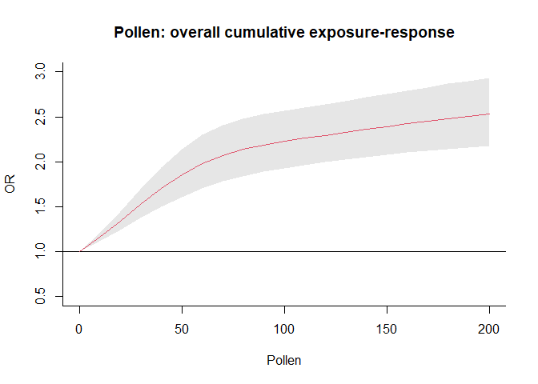
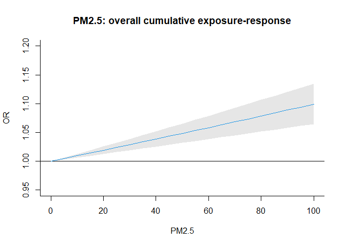
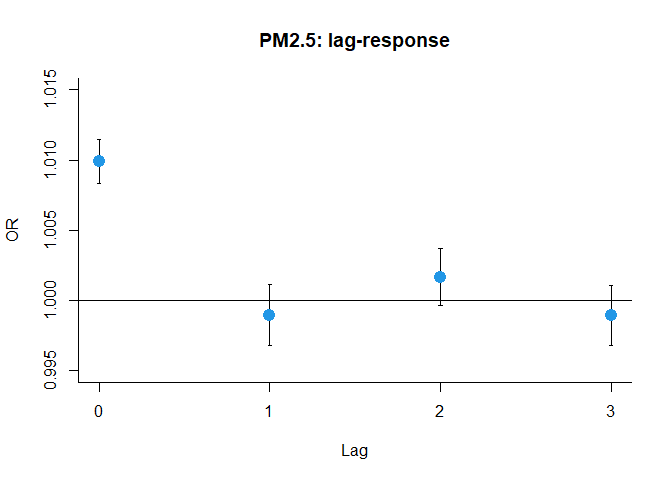
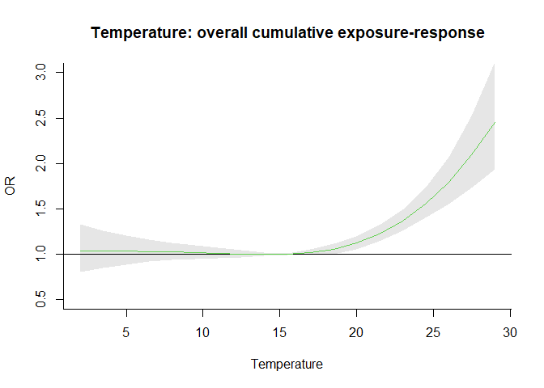
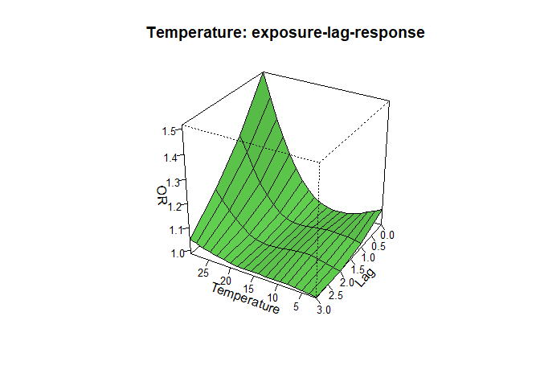

Note for CTSenvepi example
================

``` r
pacman::p_load(
  rio,            # import and export files
  here,           # locate files 
  tidyverse,      # data management and visualization
  gnm,
  dlnm,
  splines,
  skimr
)
```

# Data

``` r
# data #-----------
(data <- rio::import(here("note_CTSenvepi/envepi_original.csv")) %>% 
  tibble())
```

    ## # A tibble: 363,901 × 9
    ##    id      date        year month   dow     y pollen    pm tmean
    ##    <chr>   <IDate>    <int> <int> <int> <int>  <dbl> <dbl> <dbl>
    ##  1 sub0001 2016-08-03  2016     8     4     0  0.524 84.4  13.3 
    ##  2 sub0001 2016-08-04  2016     8     5     0  1.38  10.6   6.70
    ##  3 sub0001 2016-08-05  2016     8     6     0  1.57   8.89  5.96
    ##  4 sub0001 2016-08-06  2016     8     7     0  2.27  29.2   9.02
    ##  5 sub0001 2016-08-07  2016     8     1     0  1.82  42.0   9.20
    ##  6 sub0001 2016-08-08  2016     8     2     0  1.29  98.0  12.4 
    ##  7 sub0001 2016-08-09  2016     8     3     0  2.62  93.0  13.1 
    ##  8 sub0001 2016-08-10  2016     8     4     0  1.49  18.8  11.5 
    ##  9 sub0001 2016-08-11  2016     8     5     0  3.30   6.28 13.1 
    ## 10 sub0001 2016-08-12  2016     8     6     0  1.54  12.7  11.1 
    ## # ℹ 363,891 more rows

``` r
skimr::skim(data)
```

|                                                  |        |
|:-------------------------------------------------|:-------|
| Name                                             | data   |
| Number of rows                                   | 363901 |
| Number of columns                                | 9      |
| \_\_\_\_\_\_\_\_\_\_\_\_\_\_\_\_\_\_\_\_\_\_\_   |        |
| Column type frequency:                           |        |
| character                                        | 1      |
| Date                                             | 1      |
| numeric                                          | 7      |
| \_\_\_\_\_\_\_\_\_\_\_\_\_\_\_\_\_\_\_\_\_\_\_\_ |        |
| Group variables                                  | None   |

Data summary

**Variable type: character**

| skim_variable | n_missing | complete_rate | min | max | empty | n_unique | whitespace |
|:--------------|----------:|--------------:|----:|----:|------:|---------:|-----------:|
| id            |         0 |             1 |   7 |   7 |     0 |     1601 |          0 |

**Variable type: Date**

| skim_variable | n_missing | complete_rate | min | max | median | n_unique |
|:---|---:|---:|:---|:---|:---|---:|
| date | 0 | 1 | 2015-10-29 | 2018-11-19 | 2017-10-11 | 1118 |

**Variable type: numeric**

| skim_variable | n_missing | complete_rate | mean | sd | p0 | p25 | p50 | p75 | p100 | hist |
|:---|---:|---:|---:|---:|---:|---:|---:|---:|---:|:---|
| year | 0 | 1 | 2017.18 | 0.78 | 2015.00 | 2017.00 | 2017.00 | 2018.00 | 2018.00 | ▁▅▁▇▇ |
| month | 0 | 1 | 6.73 | 3.32 | 1.00 | 4.00 | 7.00 | 10.00 | 12.00 | ▆▅▆▆▇ |
| dow | 0 | 1 | 4.00 | 2.00 | 1.00 | 2.00 | 4.00 | 6.00 | 7.00 | ▇▃▃▃▇ |
| y | 0 | 1 | 0.04 | 0.20 | 0.00 | 0.00 | 0.00 | 0.00 | 1.00 | ▇▁▁▁▁ |
| pollen | 0 | 1 | 36.00 | 65.54 | 0.11 | 3.23 | 11.45 | 40.25 | 707.21 | ▇▁▁▁▁ |
| pm | 0 | 1 | 47.29 | 112.84 | 0.09 | 4.69 | 13.85 | 43.60 | 2140.71 | ▇▁▁▁▁ |
| tmean | 0 | 1 | 14.33 | 5.43 | 1.45 | 10.24 | 14.28 | 18.54 | 29.43 | ▂▇▇▆▁ |

``` r
data %>% count(id)
```

    ## # A tibble: 1,601 × 2
    ##    id          n
    ##    <chr>   <int>
    ##  1 sub0001    41
    ##  2 sub0002   495
    ##  3 sub0003   254
    ##  4 sub0004   622
    ##  5 sub0005    84
    ##  6 sub0006   136
    ##  7 sub0007    78
    ##  8 sub0008    57
    ##  9 sub0009   437
    ## 10 sub0010    11
    ## # ℹ 1,591 more rows

``` r
data %>% count(y)
```

    ## # A tibble: 2 × 2
    ##       y      n
    ##   <int>  <int>
    ## 1     0 349403
    ## 2     1  14498

Generate `stratum`

``` r
(data <- data %>% 
    mutate(across(.cols = c(id, month, year, dow),
                  as.factor),
           stratum = as.factor(id:year:month)))
```

    ## # A tibble: 363,901 × 10
    ##    id      date       year  month dow       y pollen    pm tmean stratum       
    ##    <fct>   <IDate>    <fct> <fct> <fct> <int>  <dbl> <dbl> <dbl> <fct>         
    ##  1 sub0001 2016-08-03 2016  8     4         0  0.524 84.4  13.3  sub0001:2016:8
    ##  2 sub0001 2016-08-04 2016  8     5         0  1.38  10.6   6.70 sub0001:2016:8
    ##  3 sub0001 2016-08-05 2016  8     6         0  1.57   8.89  5.96 sub0001:2016:8
    ##  4 sub0001 2016-08-06 2016  8     7         0  2.27  29.2   9.02 sub0001:2016:8
    ##  5 sub0001 2016-08-07 2016  8     1         0  1.82  42.0   9.20 sub0001:2016:8
    ##  6 sub0001 2016-08-08 2016  8     2         0  1.29  98.0  12.4  sub0001:2016:8
    ##  7 sub0001 2016-08-09 2016  8     3         0  2.62  93.0  13.1  sub0001:2016:8
    ##  8 sub0001 2016-08-10 2016  8     4         0  1.49  18.8  11.5  sub0001:2016:8
    ##  9 sub0001 2016-08-11 2016  8     5         0  3.30   6.28 13.1  sub0001:2016:8
    ## 10 sub0001 2016-08-12 2016  8     6         0  1.54  12.7  11.1  sub0001:2016:8
    ## # ℹ 363,891 more rows

# Analysis

``` r
# analysis #-------------------------
```

## Splines of time

``` r
range(data$date)
```

    ## [1] "2015-10-29" "2018-11-19"

``` r
diff(range(data$date))
```

    ## Time difference of 1117 days

``` r
diff(range(data$date))/365.25 * 8
```

    ## Time difference of 24.46543 days

``` r
as.numeric(diff(range(data$date))/365.25 * 8)
```

    ## [1] 24.46543

``` r
(dftrend <- round(as.numeric(diff(range(data$date))/365.25 * 8)))
```

    ## [1] 24

``` r
btrend <- ns(data$date, knots = equalknots(data$date, dftrend-1))
head(btrend)
```

    ##      1 2           3         4         5         6            7 8 9 10 11 12 13 14 15 16 17 18 19
    ## [1,] 0 0 2.58311e-08 0.1693668 0.6666379 0.1639953 0.000000e+00 0 0  0  0  0  0  0  0  0  0  0  0
    ## [2,] 0 0 0.00000e+00 0.1587385 0.6664091 0.1748517 6.974398e-07 0 0  0  0  0  0  0  0  0  0  0  0
    ## [3,] 0 0 0.00000e+00 0.1485644 0.6652794 0.1861474 8.860069e-06 0 0  0  0  0  0  0  0  0  0  0  0
    ## [4,] 0 0 0.00000e+00 0.1388345 0.6632786 0.1978526 3.438120e-05 0 0  0  0  0  0  0  0  0  0  0  0
    ## [5,] 0 0 0.00000e+00 0.1295390 0.6604362 0.2099376 8.717998e-05 0 0  0  0  0  0  0  0  0  0  0  0
    ## [6,] 0 0 0.00000e+00 0.1206680 0.6567821 0.2223727 1.771755e-04 0 0  0  0  0  0  0  0  0  0  0  0
    ##      20 21 22 23 24
    ## [1,]  0  0  0  0  0
    ## [2,]  0  0  0  0  0
    ## [3,]  0  0  0  0  0
    ## [4,]  0  0  0  0  0
    ## [5,]  0  0  0  0  0
    ## [6,]  0  0  0  0  0

## Cross-basis

A `group` argument is used to specify that the variables do not
represent a unique and complete series, but **multiple individual
series**

``` r
# pollen
cbpoll <- crossbasis(data$pollen,
                     lag = 3,
                     argvar = list(knots = c(40, 100)),
                     arglag = list(knots = 1), 
                     group = data$id)
summary(cbpoll)
```

    ## CROSSBASIS FUNCTIONS
    ## observations: 363901 
    ## groups: 1601 
    ## range: 0.1124846 to 707.2131 
    ## lag period: 0 3 
    ## total df:  9 
    ## 
    ## BASIS FOR VAR:
    ## fun: ns 
    ## knots: 40 100 
    ## intercept: FALSE 
    ## Boundary.knots: 0.1124846 707.2131 
    ## 
    ## BASIS FOR LAG:
    ## fun: ns 
    ## knots: 1 
    ## intercept: TRUE 
    ## Boundary.knots: 0 3

``` r
# PM2.5
cbpm <- crossbasis(data$pm,
                   lag = 3, 
                   arglag = list("integer"), 
                   group = data$id)
summary(cbpm)
```

    ## CROSSBASIS FUNCTIONS
    ## observations: 363901 
    ## groups: 1601 
    ## range: 0.09358365 to 2140.71 
    ## lag period: 0 3 
    ## total df:  4 
    ## 
    ## BASIS FOR VAR:
    ## fun: ns 
    ## knots:  
    ## intercept: FALSE 
    ## Boundary.knots: 0.09358365 2140.71 
    ## 
    ## BASIS FOR LAG:
    ## fun: integer 
    ## values: 0 1 2 3 
    ## intercept: TRUE

``` r
# temperature
cbtmean <- crossbasis(data$tmean,
                      lag = 3, 
                      argvar = list(knots = 1:2 * 10),
                      arglag = list(knots = 1), 
                      group = data$id)
summary(cbtmean)
```

    ## CROSSBASIS FUNCTIONS
    ## observations: 363901 
    ## groups: 1601 
    ## range: 1.453357 to 29.43134 
    ## lag period: 0 3 
    ## total df:  9 
    ## 
    ## BASIS FOR VAR:
    ## fun: ns 
    ## knots: 10 20 
    ## intercept: FALSE 
    ## Boundary.knots: 1.453357 29.43134 
    ## 
    ## BASIS FOR LAG:
    ## fun: ns 
    ## knots: 1 
    ## intercept: TRUE 
    ## Boundary.knots: 0 3

## Model fitting

Fixed-effects logistic regression

``` r
mod <- gnm(y ~ cbpoll + cbpm + cbtmean + btrend + dow, 
           eliminate = stratum, 
           data = data,
           family = binomial)
summary(mod)
```

    ## 
    ## Call:
    ## gnm(formula = y ~ cbpoll + cbpm + cbtmean + btrend + dow, eliminate = stratum, 
    ##     family = binomial, data = data)
    ## 
    ## Deviance Residuals: 
    ##        Min          1Q      Median          3Q         Max  
    ## -1.6747276  -0.3290422  -0.2354376  -0.0004515   2.8695356  
    ## 
    ## Coefficients of interest:
    ##              Estimate Std. Error z value Pr(>|z|)    
    ## cbpollv1.l1  -0.30002    0.13622  -2.202  0.02764 *  
    ## cbpollv1.l2   0.54239    0.09938   5.458 4.82e-08 ***
    ## cbpollv1.l3  -0.09855    0.10151  -0.971  0.33161    
    ## cbpollv2.l1  -0.25411    0.17021  -1.493  0.13546    
    ## cbpollv2.l2   1.01048    0.11170   9.047  < 2e-16 ***
    ## cbpollv2.l3  -0.32685    0.11559  -2.828  0.00469 ** 
    ## cbpollv3.l1   0.02849    0.22791   0.125  0.90052    
    ## cbpollv3.l2   0.33692    0.19308   1.745  0.08098 .  
    ## cbpollv3.l3  -0.14334    0.17035  -0.841  0.40009    
    ## cbpmv1.l1     2.63957    0.21102  12.509  < 2e-16 ***
    ## cbpmv1.l2    -0.27496    0.29579  -0.930  0.35260    
    ## cbpmv1.l3     0.44303    0.27455   1.614  0.10661    
    ## cbpmv1.l4    -0.28213    0.29164  -0.967  0.33334    
    ## cbtmeanv1.l1 -0.06499    0.14046  -0.463  0.64358    
    ## cbtmeanv1.l2 -0.06966    0.06773  -1.028  0.30372    
    ## cbtmeanv1.l3  0.02219    0.08206   0.270  0.78687    
    ## cbtmeanv2.l1  0.15689    0.32526   0.482  0.62955    
    ## cbtmeanv2.l2  0.33321    0.17400   1.915  0.05549 .  
    ## cbtmeanv2.l3 -0.06382    0.19077  -0.335  0.73798    
    ## cbtmeanv3.l1 -0.01804    0.15805  -0.114  0.90911    
    ## cbtmeanv3.l2  0.57857    0.07599   7.614 2.66e-14 ***
    ## cbtmeanv3.l3 -0.22203    0.09454  -2.349  0.01885 *  
    ## btrend1       0.49997    0.89426   0.559  0.57611    
    ## btrend2      -0.78980    1.05882  -0.746  0.45572    
    ## btrend3      -0.30381    1.07955  -0.281  0.77838    
    ## btrend4      -1.11639    1.14890  -0.972  0.33120    
    ## btrend5      -0.60006    1.19659  -0.501  0.61604    
    ## btrend6      -0.46005    1.22273  -0.376  0.70673    
    ## btrend7      -0.49650    1.25260  -0.396  0.69183    
    ## btrend8       0.11691    1.27082   0.092  0.92670    
    ## btrend9       0.23616    1.28490   0.184  0.85417    
    ## btrend10     -0.15750    1.30360  -0.121  0.90384    
    ## btrend11      0.29905    1.33926   0.223  0.82331    
    ## btrend12     -0.07046    1.38174  -0.051  0.95933    
    ## btrend13      1.31057    1.40832   0.931  0.35206    
    ## btrend14      1.19413    1.42440   0.838  0.40184    
    ## btrend15      0.74037    1.43511   0.516  0.60593    
    ## btrend16      1.62949    1.44381   1.129  0.25907    
    ## btrend17      1.17204    1.45328   0.806  0.41997    
    ## btrend18      1.39789    1.46986   0.951  0.34159    
    ## btrend19      0.44094    1.50390   0.293  0.76937    
    ## btrend20      0.12474    1.51905   0.082  0.93456    
    ## btrend21      0.69397    1.53996   0.451  0.65225    
    ## btrend22      0.96710    1.42490   0.679  0.49732    
    ## btrend23     -0.17876    2.13977  -0.084  0.93342    
    ## btrend24      1.49634    1.35852   1.101  0.27070    
    ## dow2          0.29250    0.03445   8.492  < 2e-16 ***
    ## dow3          0.28133    0.03495   8.049  < 2e-16 ***
    ## dow4          0.31571    0.03474   9.087  < 2e-16 ***
    ## dow5          0.32311    0.03488   9.263  < 2e-16 ***
    ## dow6          0.31949    0.03476   9.193  < 2e-16 ***
    ## dow7         -0.04660    0.03696  -1.261  0.20731    
    ## ---
    ## Signif. codes:  0 '***' 0.001 '**' 0.01 '*' 0.05 '.' 0.1 ' ' 1
    ## 
    ## (Dispersion parameter for binomial family taken to be 1)
    ## 
    ## Residual deviance: 98117 on 345731 degrees of freedom
    ## AIC: 124851
    ## 
    ## Number of iterations: 6

## Predict the association of the various terms with the risk of respiratory symptoms

``` r
cppoll <- crosspred(cbpoll, mod, at = 0:20 * 10, cen = 0)
cppm <- crosspred(cbpm, mod, at = 0:20 * 5, cen = 0)
cptmean <- crosspred(cbtmean, mod, cen = 15, by = 1.5)
```

## Plot

### Pollen

``` r
plot(cppoll, 
     "overall", 
     xlab = "Pollen", 
     ylab = "OR", 
     col = 2,
     main = "Pollen: overall cumulative exposure-response", 
     ylim = c(0.5, 3))
```

<!-- -->

``` r
plot(cppoll,
     xlab = "Pollen",
     zlab = "OR",
     main = "Pollen: exposure-lag-response",
     cex.axis = 0.8,
     col = 2)
```

<!-- -->

### PM2.5

``` r
plot(cppm,
     var = 10, "overall", 
     xlab = "PM2.5", 
     ylab = "OR", 
     col = 4,
     main = "PM2.5: overall cumulative exposure-response", 
     ylim = c(0.95, 1.20))
```

<!-- -->

``` r
plot(cppm,
     var = 10,
     ci = "b",
     type = "p", 
     ylab = "OR", 
     col = 4, 
     pch = 19, 
     cex = 1.7,
     xlab = "Lag", 
     main = "PM2.5: lag-response", 
     lab = c(3, 5, 7), 
     ylim = c(0.995, 1.015))
```

<!-- -->

### Temperature

``` r
plot(cptmean, 
     "overall", 
     xlab = "Temperature", 
     ylab = "OR", 
     col = 3,
     main = "Temperature: overall cumulative exposure-response", 
     ylim = c(0.5, 3))
```

<!-- -->

``` r
plot(cptmean, 
     xlab = "Temperature", 
     zlab = "OR", 
     ltheta = 240, 
     lphi = 60, 
     cex.axis = 0.8, 
     main = "Temperature: exposure-lag-response", 
     col = 3)
```

<!-- -->
